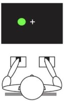

### Procedure
In a typical Simon task, participants are shown a stimulus (e.g., a letter or a color patch) on either the left or the right side of the display screen. Participants’ task is to press either a left key or a right key corresponding to the instructed targets/ objects. In the traditional Simon task, the stimulus does not represent the location semantically, that is, the concept LEFT or RIGHT mapped to horizontal axis. In other words, the location of the stimulus is semantically irrelevant to the stimulus, such as color patch that does not show any semantic association with orientation or direction. 

In this experiment students need to respond to the words LEFT and RIGHT with "A" key (which is on the left side of the keyboard) and with the "L" key (which is on the right side of the keyboard).
 
The Simons effect here simply means that you will respond more slowly to the word LEFT when it appears on the RIGHT side of the screen (i.e., incompatible condition) than when it appears on the LEFT side (compatible condition) of the screen.
 
